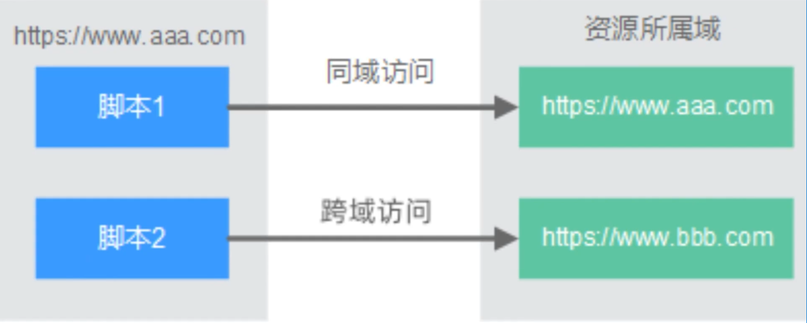

## 基础概念

### 在Java中, 为什么不允许从静态方法中访问非静态变量
1. 静态变量属于类本身，在类加载的时候就会分配内存，可以通过类名直接访问；
2. 非静态变量属于类的对象，只有在类的对象产生时，才会分配内存，通过类的实例去访问；
3. 静态方法也属于类本身，但是此时没有类的实例，内存中没有非静态变量，所以无法调用。

### 使用JDBC操作数据库时, 如何提升读取数据的性能, 如何提升更新数据的性能
1. 读取: 可以通过指定结果集Statement对象的setFetchSize()方法指定每次抓取的记录数(典型的空间换时间策略);
2. 更新 / 插入
   - 暂停索引，更新后恢复.避免在更新的过程中涉及到索引的重建.
   - 要提升更新数据的性能可以使用PreparedStatement语句构建批处理, 将若干SQL语句置于一个批处理中执行.
   - 创建一临时的大的表空间用来应对这些更新动作．

### JDBC中的事务处理, 都是通过Connection来处理的, 同一事务中所有的操作, 都在使用同一个Connection对象.
1. 开启事务: setAutoCommit(boolean b) 设置是否提交事务(默认为true) 就是每条sql语句都是一个单独的事务, 设置值为false后, 开启事务
2. 事务的提交 commit()
3. 事务的回滚 rollback() 当事务在运行过程中发生故障(异常), 事务不能执行, 进行事务的回滚, 将对数据库的所有操作都撤回, 回滚到事务开启的状态

### Java的单点登录
在多系统共存的情况下, 用户只要在任何一个系统登录之后, 就不用在其它的系统再次登录,
单点登录是一种身份验证的解决方案, 可以让用户通过一次认证, 登录多个应用程序和网站,
登录后把登录状态写入到SSO的session中, 浏览器也会写入SSO下的cookie

### 开放性问题: 如何去提升接口的性能
1. 数据库层面: SQL优化, 数据库优化
2. 频繁访问数据库的热数据: 采用缓存
3. 涉及到远程调用或者耗时的方法调用, 采用异步方式避免同步阻塞
4. 代码本身的优化
5. 服务器硬件, 单节点部署计算能力瓶颈, 改为分布式部署

### 开放性问题: CPU利用率过高, 系统反应慢的问题怎么排查

## Spring

### Springboot如何解决跨域问题

1. jsonp
2. CORS: 在后端解决跨域的方案
   - 注解: @CrossOrigin(origins = "https://localhost:8080")指定允许哪些origins允许跨域
   - 使用WebMvcConfigurer接口, 重写addCorsMappings方法来配置允许跨域的请求源

### Spring 如何去解决循环依赖问题 (一个或多个bean实例之间存在直接或间接依赖关系)
1. 互相依赖: A-B / B-A
2. 间接依赖: A-B / B-C / C-A
3. 自我依赖: A-A
   Spring设计了三级缓存, 来解决循环依赖问题 https://www.bilibili.com/video/BV1Mg411r7fv/?spm_id_from=333.999.0.0&vd_source=e839d03e8fb3384d0ed571c1ffd80e49

### 讲一下 Mybatis 的二级缓存机制
Mybatis的二级缓存, 是为了避免每次数据的访问都去查询数据库,
一级缓存: SqlSession级别的缓存, 也叫本地缓存, Mybatis把查询出来的数据保存到SqlSession的本地缓存中.
二级缓存: 跨SqlSession级别的缓存(全局缓存), 多个用户查询时, 只要有任何一个用户拿到数据, 放到二级缓存中, 其它的SqlSession直接从二级缓存中拿.
开启二级缓存之后, 顺序: 二级 > 一级 > 数据库

## 并发编程

### 高并发情况下, 怎么去保证接口的一个幂等性 (一个接口使用相同的参数重复执行, 对数据造成的改变, 只发生一次) (比如支付操作)
1. 使用数据库唯一索引, 把消息的md5值插入, 避免重复
2. 使用Redis中的set NX 命令, 把当前请求中的唯一标志, 存储到redis中
3. 在业务中带上状态, 核心本质都是去识别当前请求是否是重复请求

// Java中反射的一个核心作用: 允许程序在运行的时候访问对象的内部属性和方法
// 反射在Java中的应用: Spring用反射创建和管理bean, UT, 