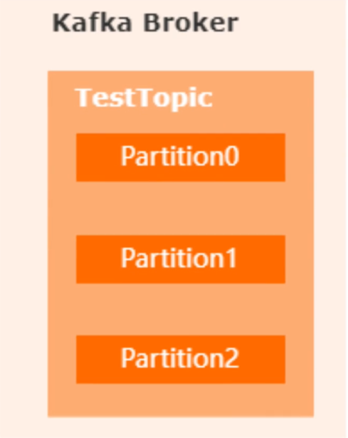
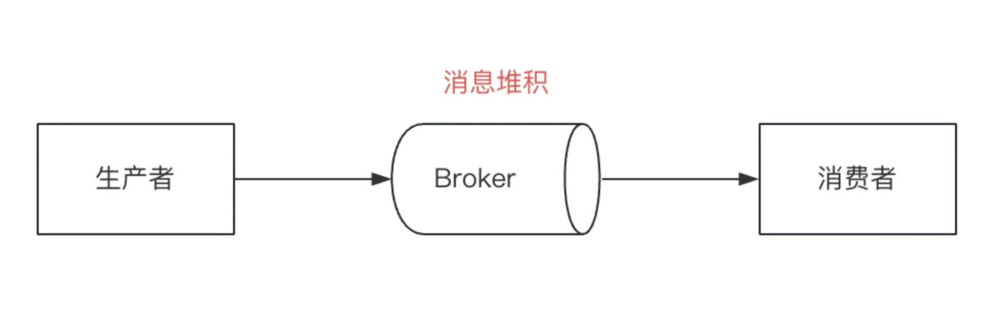

## 消息队列

### MQ是如何保证消息的顺序性的 (Kafka)
Kafka为什么会存在无序消费, Kafka是如何保证有序消费的
在Kafka的架构中, 使用Partition的分区机制, 去实现消息的物理存储, 在同一个topic中, 有多个partition, 生产者发送消息时, 根据消息的key进行取模决定发到哪一个分区

### 线上几百万的消息积压怎么处理

1. 消费者处理速度慢: 增加消费者的数量(比如增加线程)
...

### 如何保证消息不被重复消费
